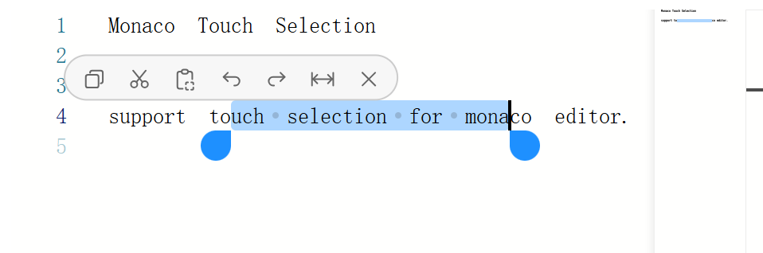

# Monaco Touch Selection

support touch selection for monaco editor.



```
npm install monaco-touch-selection
```

## Example

```html
<div id="container"></div>
```

```typescript
import * as monaco from 'monaco-editor';
import {editorTouchSelectionHelp} from 'monaco-touch-selection';
import 'monaco-touch-selection/style.css';

const element = document.getElementById('container')

const editor = monaco.editor.create(element, {
    value: '',
});

editorTouchSelectionHelp({
    editor,
    element
})
```

## API

Give your editor to `editorTouchSelectionHelp`.

```typescript
declare const editorTouchSelectionHelp: (editor: ICodeEditor, options?: {
    tools?: SelectorMenuToolConfig
    selectionSyncTimeout?: number | undefined
    toolActionErrorHandler?: (name: string, error: Error | unknown) => Promise<void> | void
}) => void
```

## Menu Tools

Here is the type for menu tool.

```typescript
type SelectorMenuTool = {
    name: string
    innerHTML: string | Element | (() => string | Element)
    action: () => (Promise<void> | void)
}
```

You can customize menu tools by `editorTouchSelectionHelp` argument `tools` like this:

```typescript
editorTouchSelectionHelp(editor, {
    tools: ({defaultTools}) => {
        const copyTool = defaultTools.get(DefaultToolName.Copy)
        if (copyTool) {
            copyTool.action = () => {
                // TODO: change default copy action
            }
        }
        return defaultTools.values()
    }
})
```

Here is enum for default tools.

```typescript
declare enum DefaultToolName {
    Copy = "copy",
    Cut = "cut",
    Paste = "paste",
    SelectAll = "selectAll",
    Undo = "undo",
    Redo = "redo",
    Close = "close"
}
```

Here is type for menu tool config function.

```typescript
type SelectorMenuToolConfig = (options: {
    editor: ICodeEditor
    selectorMenu: HTMLDivElement
    defaultTools: Map<DefaultToolName, SelectorMenuTool>
    openMenu: () => void
    closeMenu: () => void
}) => Iterable<SelectorMenuTool> | undefined
```

## Style

If you want to make simple style modifications, you can override the following CSS variables:

```css
:root {
    --monaco-editor_touch-selection_z-index: 100000;
    --monaco-editor_touch-selector_color: #1E90FF;
    --monaco-editor_touch-selector_size: 1.2rem;

    --monaco-editor_touch-selector-menu_z-index: 100001;
    --monaco-editor_touch-selector-menu_bg-color: #f7f7f7;
    --monaco-editor_touch-selector-menu_height: 1.8rem;
    --monaco-editor_touch-selector-menu_border-color: #ccc;
    --monaco-editor_touch-selector-menu_icon-color: #666;
}
```

For more extensive customization, you can directly modify or extend the styles in [style.css](src/style.css).
